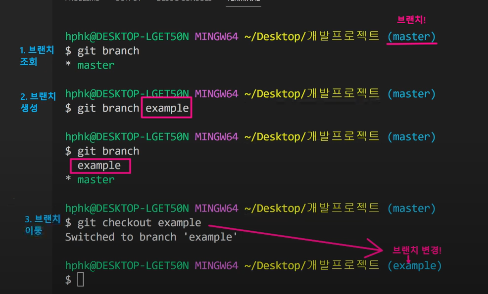

#### 20220707 Github으로 협업하는 흐름

$git clone(url)  타인의 깃 다운 받은 후

$git pull origin master 하면 본 주인이 수정한 이후의 값들을 연동할 수 있다

### git flow

깃을 활용하여 협엽하는 흐름으로 브랜치를 활용하는 전략을 의미

ex. 사용자는 과거의 실제 개발내용을 보고 있는것이다. 지금 개발하는건 볼 수 가 없다. 따라서? 개발자가 시즌맞이 새로운 개발을 해내간다? 

ㅇ-ㅇ-ㅇ-ㅇ 신규개발

1집단) 네이버 홈 휴가로그 update

2집단) 브랜치를 따서 네이버 페이 휴가 이벤트 update

3집단) 검색 여행지 검색 update

각 집단이 완료되면 합쳐나가는 과정 필요

**브랜치의 목적이란? 독립적인 버전을 만들어 나갈 수 있도록 하는 것**

**Branch basic command**

1. 브랜치 생성 $git branch {branch name}

2. 브랜치 이동 $git checkout {branch name}

3. 브랜치 생성 및 이동 $git checkout-b {branch name}

4. 브랜치 목록 $git branch

5. 브랜치 삭제 $git branch -d{branch name}


### branch merge

각 branch에서 작업을 한 이후 이력을 합치기 위해서는 일반적으로 merge 명령어를 사용한다. 병합을 진행할 때, 만약 서로 다른 이력(commit)에서 동일한 파일을 수정한 경우 충돌이 발생할 수 있다. 이 경우에는 반드시 직접 수정을 진행해야 한다. 충돌이 발생한 것은 오류가 발생한 것이 아니라 이력이 변경되는 과정에서 반드시 발생할 수 있는 것이다.




**Merge** 기준이 되는 레지토리(ex.master) 에서 $git merge example

각자 커밋이 있는데, 같은 파일이 수정됨. 즉, 일단 가지 생성하면서 이동한다

$git checkout -b feature/test

Switched to a new branch 'feature/test'


## Git hub flow

1. Feature Vranch Workflow shared repository model(저장소의 소유권이 있는 경우)

2. Fork workflow : Fork % pull moderl (저장소의 소유권 x)


**Git pull flow 실습 및 내용**

```bash
307@DESKTOP-SLE8MK8 MINGW64 ~/Desktop/test-01 (master)
$ git branch example

307@DESKTOP-SLE8MK8 MINGW64 ~/Desktop/test-01 (master)
$ git checkou example
git: 'checkou' is not a git command. See 'git --help'.

The most similar command is
        checkout

307@DESKTOP-SLE8MK8 MINGW64 ~/Desktop/test-01 (master)
$ git checkout example
Switched to branch 'example'

307@DESKTOP-SLE8MK8 MINGW64 ~/Desktop/test-01 (example)
$ git add .

307@DESKTOP-SLE8MK8 MINGW64 ~/Desktop/test-01 (example)
$ git commit -m'git test'
[example 2625bb0] git test
 1 file changed, 1 insertion(+)
 create mode 100644 "1\355\232\214\354\260\250/\354\236\204\354\234\240\354\240\225/README.md"

307@DESKTOP-SLE8MK8 MINGW64 ~/Desktop/test-01 (example)
$ git push origin example
Enumerating objects: 7, done.
Counting objects: 100% (7/7), done.
Delta compression using up to 4 threads
Compressing objects: 100% (3/3), done.
Writing objects: 100% (5/5), 479 bytes | 159.00 KiB/s, done.
Total 5 (delta 0), reused 0 (delta 0), pack-reused 0
remote:
remote: Create a pull request for 'example' on GitHub by visiting:
remote:      https://github.com/youjoy123/test-01/pull/new/example
remote:
To https://github.com/youjoy123/test-01.git
 * [new branch]      example -> example
```


