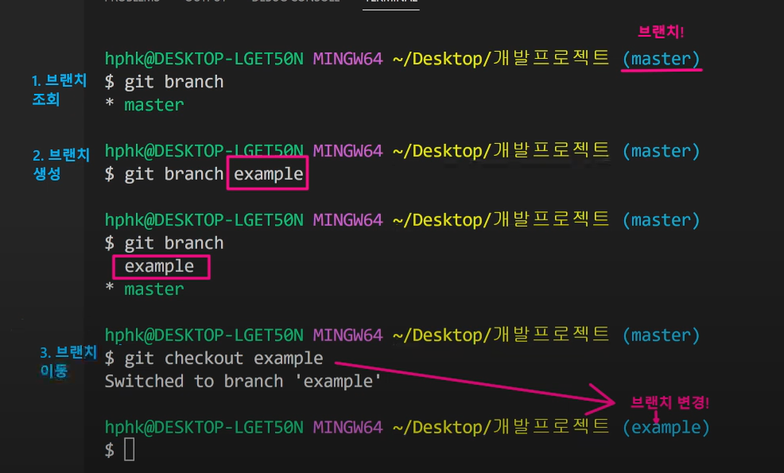

220707 추후 수정 예정

$git clone(url) 

타인의 깃 다운 받은 후

$git pull origin master 하면 본 주인이 수정한 이후의 값들을 연동할 수 있다

### git flow 

깃을 활용하여 협엽하는 흐름으로 브랜치를 활용하는 전략을 의미

ex.

사용자는 과거의 실제 개발내용을 보고 있는것이다. 지금 개발하는건 볼 수 가 없지..

개발자가 시즌맞이 새로운 개발을 해내간다? 

ㅇ-ㅇ-ㅇ-ㅇ 신규개발

1집단) 네이버 홈 휴가로그 update

2집단) 브랜치를 따서 네이버 페이 휴가 이벤트 update

3집단) 검색 여행지 검색 update

각 집단이 완료되면 합쳐나가는 과정 필요


브랜치의 목적이란?

독립적인 버전을 만들어 나갈 수 있도록


### branch merge

이력(커밋/버전)




example.txt 내용에서 내용을 채운 이후, 작업 확인 차 git status 확인 후 git add. >git commit

**그다음!!**

git log --online, git check out master 하면 Readme.md만 남음

HEAD :: 내가 지금  이동해서 보고있는 위치의 정보를 알려주는 것

(head -> master) , (head ->example)


### merge

기준이 되는 레지토리(ex.master) 에서 $git merge example


## 2 다른 파일 합치기


## 3 진정한 협업

각자 커밋이 있는데, 같은 파일이 수정됨

일단 가지 생성하면서 이동한다

$git checkout -b feature/test

Switched to a new branch 'feature/test'


## git hub flow

1. Feature Vranch Workflow

   shared repository model(저장소의 소유권이 있는 경우)

   2. Fork workflow

      Fork % pull moderl

      (저장소의 소유권 x)


## git pull flow 실습 및 내용

```bash

307@DESKTOP-SLE8MK8 MINGW64 ~/Desktop/test-01 (master)
$ git branch example

307@DESKTOP-SLE8MK8 MINGW64 ~/Desktop/test-01 (master)
$ git checkou example
git: 'checkou' is not a git command. See 'git --help'.

The most similar command is
        checkout

307@DESKTOP-SLE8MK8 MINGW64 ~/Desktop/test-01 (master)
$ git checkout example
Switched to branch 'example'

307@DESKTOP-SLE8MK8 MINGW64 ~/Desktop/test-01 (example)
$ git add .

307@DESKTOP-SLE8MK8 MINGW64 ~/Desktop/test-01 (example)
$ git commit -m'git test'
[example 2625bb0] git test
 1 file changed, 1 insertion(+)
 create mode 100644 "1\355\232\214\354\260\250/\354\236\204\354\234\240\354\240\225/README.md"

307@DESKTOP-SLE8MK8 MINGW64 ~/Desktop/test-01 (example)
$ git push origin example
Enumerating objects: 7, done.
Counting objects: 100% (7/7), done.
Delta compression using up to 4 threads
Compressing objects: 100% (3/3), done.
Writing objects: 100% (5/5), 479 bytes | 159.00 KiB/s, done.
Total 5 (delta 0), reused 0 (delta 0), pack-reused 0
remote:
remote: Create a pull request for 'example' on GitHub by visiting:
remote:      https://github.com/youjoy123/test-01/pull/new/example
remote:
To https://github.com/youjoy123/test-01.git
 * [new branch]      example -> example

```

