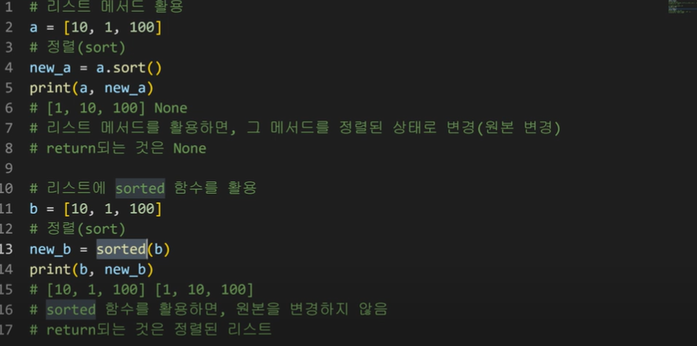
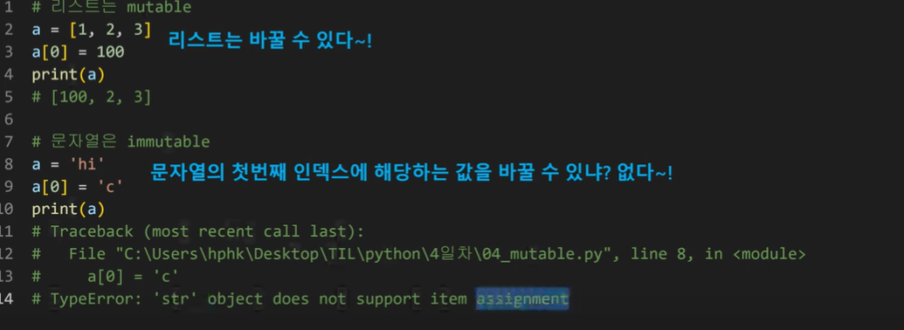

2022.7.14

### DATA STRUCTURE 데이터구조

**함수 **

input을 넣을때 어떠한 타입을 넣어서 output이 나오는데 이 때 output이 어떤 타입인지 확인이 필요하다.

**소괄호** 함수호출? 

ex1)

input() ==> 문자열로 결과가 나오게 됨

즉, split() ==>문자열쪼개줌

ex2)

[1,2,3,].append(4)

앞에 있는 타입==>리스트.


**함수의 타입.메서드()** 

타입 S

메서드 v 

타입 너 메서드 해 이런식으로 이해할 것


#### 메서드 methods



```python
#리스트 메서드 활용
a=[10,1,100]
#정렬
```

메서드와 함수 sort 결과 값 다르다.

#실제활용코드

a=[10,1,100]

a.sort()

#a를 정렬된 상태로 활용


b=[10,1,100]

b=sorted(b)

#b를정렬된상태로활용


문자열은 이미터블, 바꿔줄 수 업승ㅁ

리스트 뮤터블, 바꿔줄 수 있음




### 딕셔너러니 

딕셔너리는 키로접근하고 {}

리스트는 인덱스로 접근 []